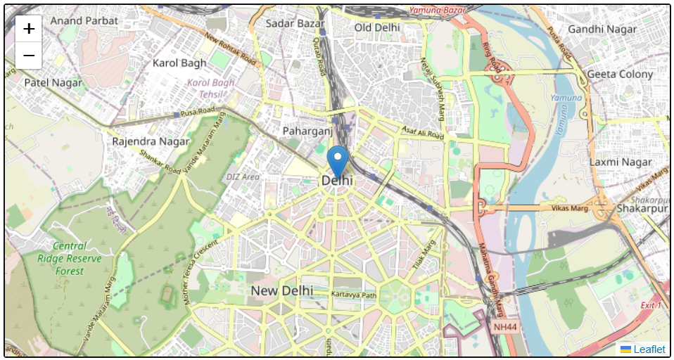
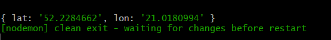
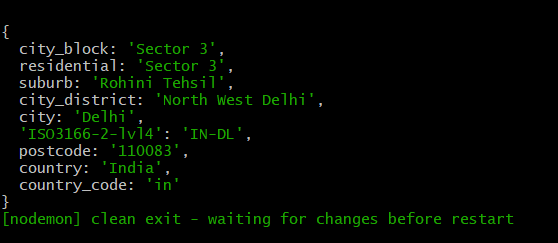
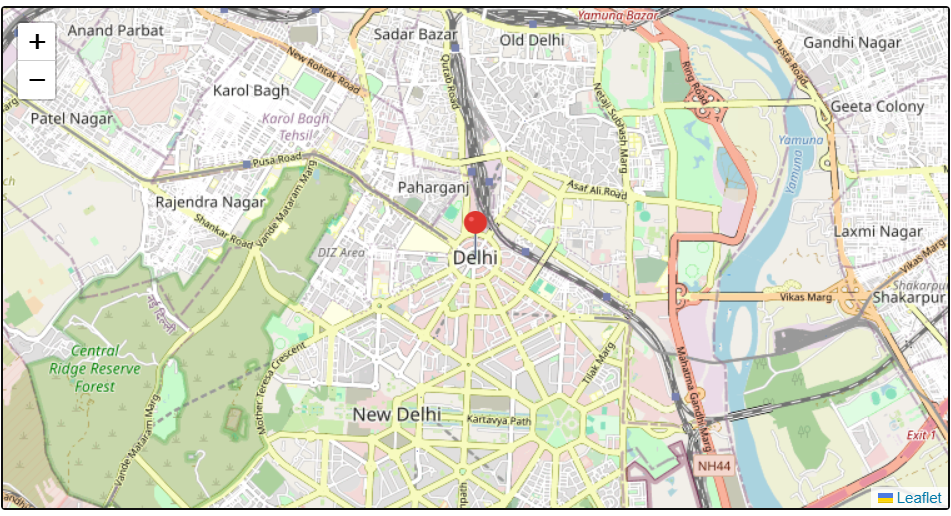
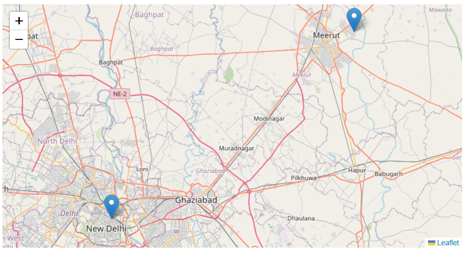
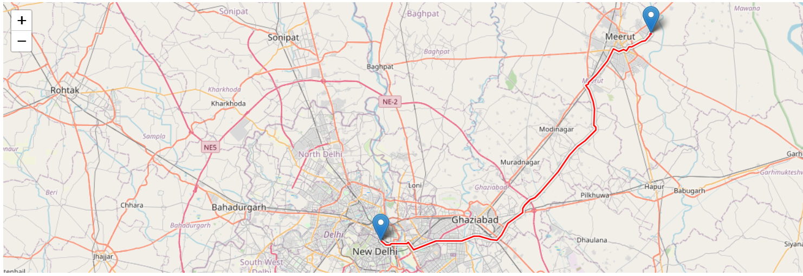
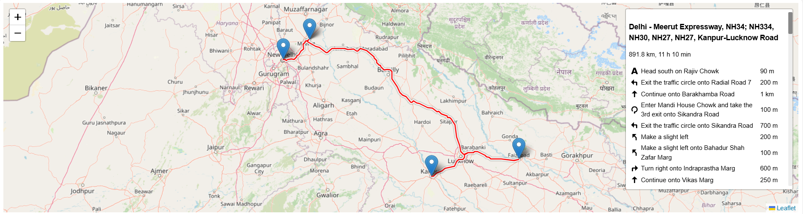

# MAPWIZ-LIB 🌍

**A lightweight Leaflet-based JavaScript library for seamless map rendering, geocoding, reverse geocoding, routing, and more.**

---

## 📦 Installation

```bash
npm install mapwiz
```

---

## 🗺️ Features

- 📍 Geocode locations to coordinates  
- 🧭 Reverse geocode coordinates to addresses  
- 🗺️ Display maps with markers and custom icons  
- 📌 Plot multiple locations on a single map  
- 🔁 Draw routes between two or more locations  
- ✨ Simple, modular, and easy-to-use API

---

## 🌐 Include These in Your HTML

```html
<!-- Leaflet CSS and JS -->
<link rel="stylesheet" href="https://unpkg.com/leaflet@1.9.4/dist/leaflet.css" />
<script src="https://unpkg.com/leaflet@1.9.4/dist/leaflet.js"></script>

<!-- Leaflet Routing Machine -->
<link rel="stylesheet" href="https://unpkg.com/leaflet-routing-machine@latest/dist/leaflet-routing-machine.css" />
<script src="https://unpkg.com/leaflet-routing-machine@latest/dist/leaflet-routing-machine.js"></script>
```

---

## 🚀 Usage

### 1. Import the Library

```js
import MapWiz from "mapwiz-lib";
```

---

### 📌 Examples (With Screenshots)

#### 📍 Show a Map with Marker

```js
MapWiz.showMap("mapContainer", "Delhi");
```



---

#### 🧭 Get Coordinates of a Location

```js
const coords = await MapWiz.getCoordinates("Warsaw");
```



---

#### 🧠 Reverse Geocode Coordinates

```js
const address = await MapWiz.reverseGeocode(28.7041, 77.1025);
```



---

#### 🎯 Show Custom Marker Icon

```js
MapWiz.showMapWithCustomMarker("icon.png", "mapContainer", "Hyderabad");
```



---

#### 🗺️ Plot Multiple Locations

```js
MapWiz.plotMultipleLocations("mapContainer", ["Delhi", "Meerut"]);
```



---

#### 🚗 Draw Route Between Two Places

```js
MapWiz.drawRoute("mapContainer", "Delhi", "Meerut");
```



---

#### 📍 Draw Route with Multiple Waypoints

```js
MapWiz.drawRouteWithWaypoints("mapContainer", ["Delhi", "Meerut", "Faizabad", "Kanpur"]);
```



---

## ⚠️ Requirements

- Include **Leaflet** and **Leaflet Routing Machine** via CDN (see above).  
- A valid container element with an `id` (e.g., `mapContainer`) should be present in your HTML.

---

## 📃 License

MIT License

---

## ✨ Author

Made with 💡 by Vaibhav Pacherwal
